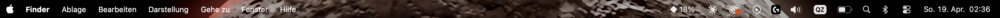

# Claude Usage Widget

A lightweight macOS menu bar app and desktop widget that tracks your Claude
subscription usage in real time — 5-hour session, weekly limits, Sonnet, Opus,
**Claude Design**, plus extra-usage credits and current prepaid balance.

No API key required. Reads your existing Claude Desktop session from the local
keychain (same auth path Claude Desktop itself uses).

<p>
  
  
</p>

## Features

- Menu bar indicator showing current 5-hour session usage %
- Desktop widget with full breakdown (session, weekly, per-model, Claude Design,
  extra usage, prepaid balance)
- Color-coded progress bars with configurable warning threshold
- Auto-refresh (configurable interval, default 2 min)
- Auto-start at login (toggle in settings)
- Native SwiftUI, ~500 KB app bundle

## Requirements

- macOS 14 (Sonoma) or newer
- Apple Silicon (arm64)
- [Claude Desktop](https://claude.ai/download) installed and signed in
- Python 3 (ships with macOS)

## Install

### From DMG (recommended)

1. Download `Claude Usage.dmg` from
   [Releases](https://github.com/Idefixart/claude-usage-widget/releases/latest)
2. Open the DMG, drag **Claude Usage** into `Applications`
3. First launch: right-click the app → **Open** → confirm the Gatekeeper
   dialog (the app is ad-hoc signed, not notarized)

If macOS still blocks it ("Apple could not verify..."), run once in Terminal:

```bash
xattr -dr com.apple.quarantine "/Applications/Claude Usage.app"
```

Then open normally.

On first fetch, the Python script auto-installs two small dependencies
(`cryptography`, `curl_cffi`) via `pip3 --user`.

### Build from source

```bash
git clone https://github.com/Idefixart/claude-usage-widget.git
cd claude-usage-widget
./build.sh
open "build/Claude Usage.app"
```

To produce a shareable DMG with app icon embedded:

```bash
./package.sh
# -> build/Claude Usage.dmg
```

## How it works

- `fetch_usage.py` reads Claude Desktop's cookie database at
  `~/Library/Application Support/Claude/Cookies`, decrypts it with the AES key
  stored under `Claude Safe Storage` in your Keychain, and calls the
  `claude.ai/api/organizations/{id}/usage` endpoint your browser uses.
- `main.swift` is a native SwiftUI menu bar app that runs the Python script on
  a timer and renders the results.
- No data leaves your machine. No tracking, no analytics, no telemetry.

## Configuration

Click ◆ in the menu bar → **Einstellungen...** to change:

- Refresh interval (1–15 min)
- Warning threshold % (progress bars turn red past this)
- Auto-start at login

Config file: `~/.claude-usage-widget/config.json`

## Privacy & Security

- **Keychain access**: the Python helper calls `security find-generic-password
  -s "Claude Safe Storage"` once per fetch. This is the same API Claude Desktop
  uses. Nothing is stored or logged.
- **Cookie decryption**: happens entirely in-process, in your user session.
- **Network**: only requests sent are to `claude.ai` with your existing
  session cookies. No third-party endpoints.
- Review the code yourself — it's ~850 lines total across two files:
  - [`fetch_usage.py`](./fetch_usage.py) — cookie decrypt + API call
  - [`main.swift`](./main.swift) — SwiftUI app

## Project layout

```
main.swift              SwiftUI menu bar + desktop widget
fetch_usage.py          Keychain + cookie decrypt + API fetch
build.sh                Compile app bundle
package.sh              Build distributable DMG with icon
install.sh              Install to /Applications
```

## Known limits

- Apple Silicon only (arm64 target). Intel Macs need a recompile with a
  universal target.
- Ad-hoc signed. On a fresh Mac without a paid Apple Developer account, first
  launch requires the Gatekeeper bypass described above.
- Claude's internal bucket names (`seven_day_omelette`, etc.) are not public
  API — they can change without notice. If a future release breaks the widget,
  open an issue.

## Contributing

PRs welcome. Keep changes small and focused.

## License

MIT — see [LICENSE](./LICENSE).
